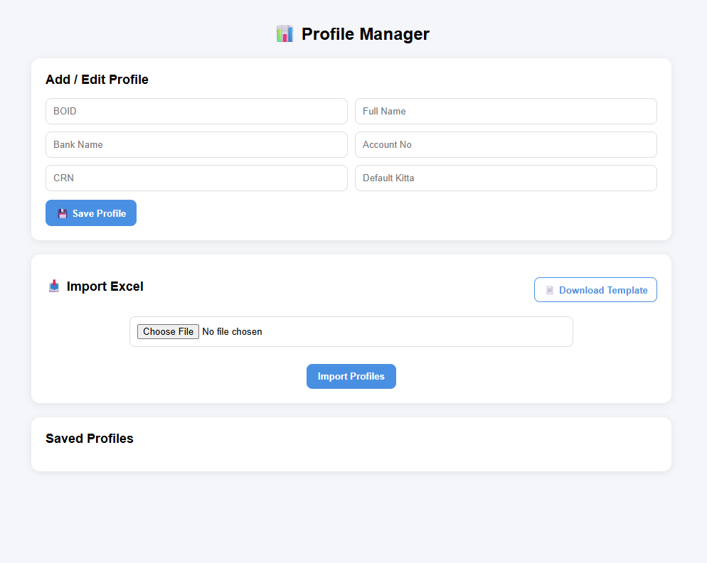
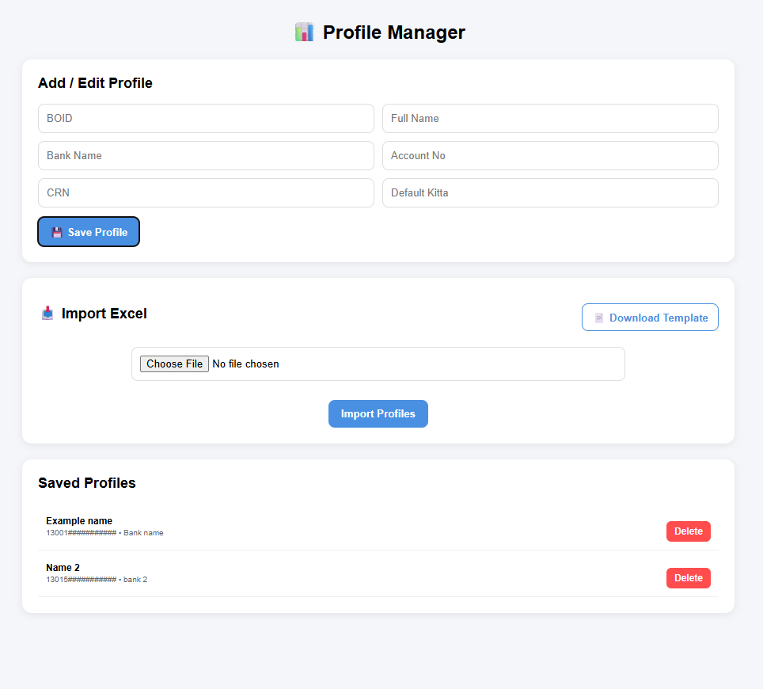
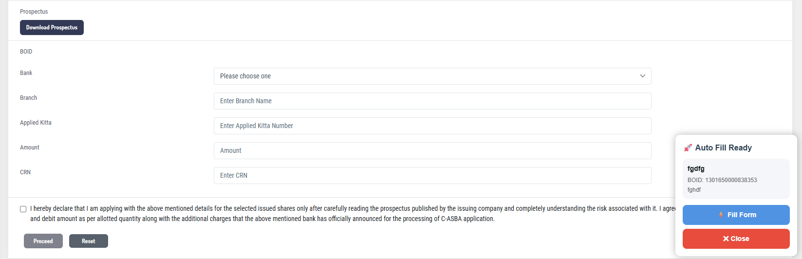

# 🚀 MeroShare AutoFill Pro

A Chrome Extension that automates form filling for MeroShare IPO applications using saved user profiles.

---

## ✨ Features

- ⚡ Auto-detect BOID on apply page
- 👤 Multi-profile management
- 📥 Excel import for bulk profiles
- 📄 Excel template generator
- 🧠 Smart bank selection by name
- 🔁 Auto-fill CRN, account, kitta
- 💾 Chrome storage based persistence
- 🎯 Works only on MeroShare apply page

---

## 🖼️ Screenshots

### Profile Manager

### Auto Fill Popup

---

## 📥 Installation (Developer Mode)

1. Download or clone this repo
2. Open Chrome
3. Go to: chrome://extensions
4. Enable **Developer Mode**
5. Click **Load Unpacked**
6. Select `/extension` folder

---
## 2️⃣ Add Profiles (Option Page)
### Open the extension options page
1. Right-click extension → Options
2. OR open from extension details
3. Add a new profile:
     BOID (16-digit number),
   Name,
   Bank Name (must match MeroShare exactly),
   Account Number,
   CRN Number,
   Default Kitta
4. Click Save Profile
---
## 📥 Optional: Import from Excel
### Open Profile Manager (Options page)
1. Click Download Template
2. Fill Excel file (do NOT change headers)
3. Click Import Profiles

#### ⚠ Important:

1. BOID, Account No, CRN must be TEXT format in Excel
2. Do NOT use scientific format (e.g. 1.2E+15)
---
## 📊 Excel Import Format

| boid | name | bank | accountNo | crn | quantity |
|------|------|------|------------|-----|----------|

⚠️ Use TEXT format for BOID & account numbers

---

## ⚙️ How It Works

1. Detects MeroShare Apply page
2. Finds BOID automatically
3. Matches saved profile
4. Opens floating popup
5. Auto-fills form fields

---

## 🔒 Privacy

- All data stored locally in Chrome storage
- No external API calls
- No data tracking

---

## 🛠️ Tech Stack

- JavaScript (Vanilla)
- Chrome Extension Manifest V3
- SheetJS (optional)
- DOM automation

---

## 📌 Roadmap

- [ ] Multi-account switcher UI
- [ ] Auto-submit option
- [ ] Validation system for BOID
- [ ] Cloud sync (optional)
- [ ] Dark mode UI

---

## 👨‍💻 Author

Built by Raju (Full Stack .NET Developer)

---

## 📄 License

MIT License